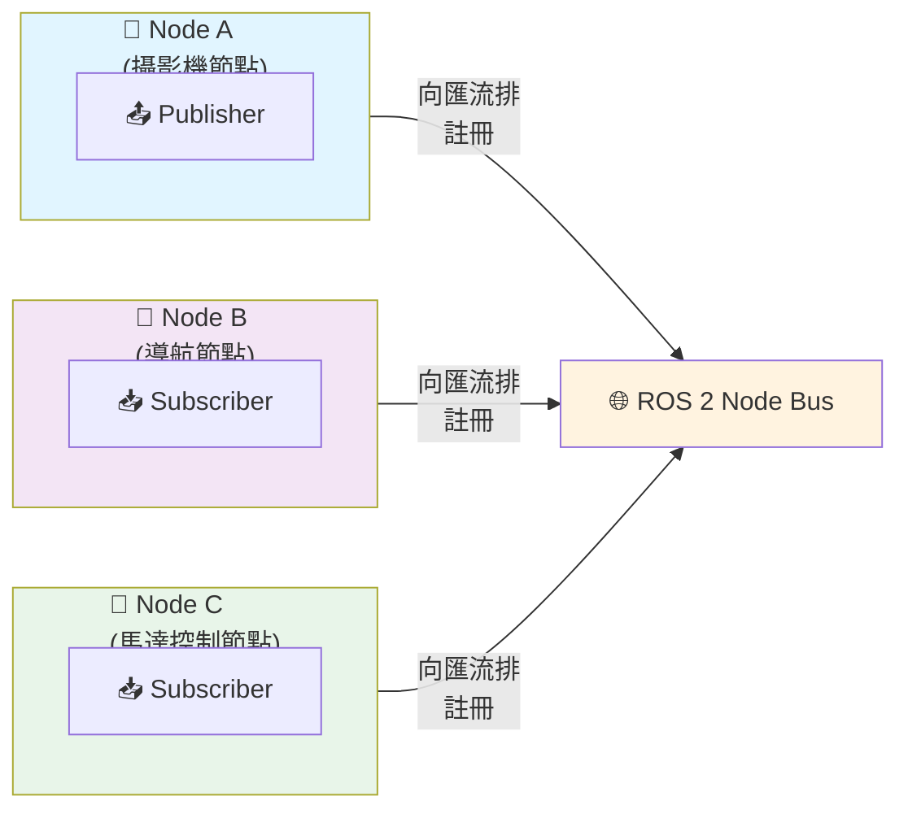
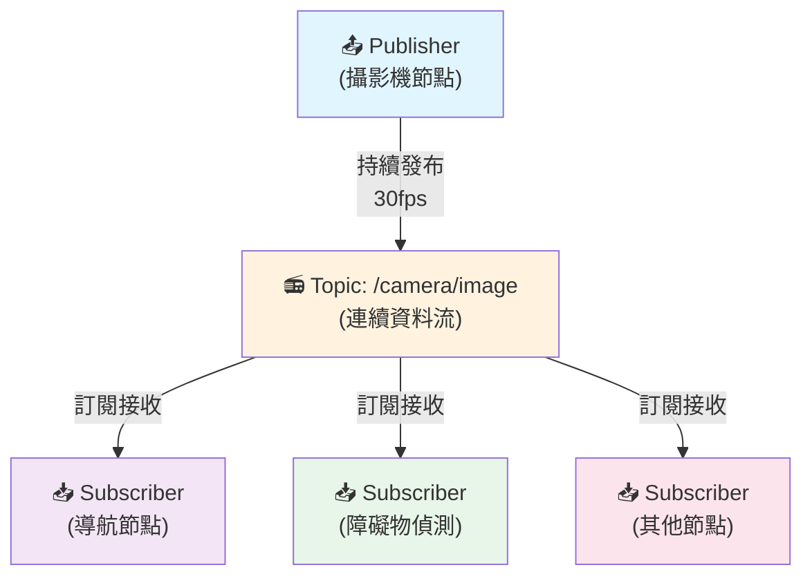
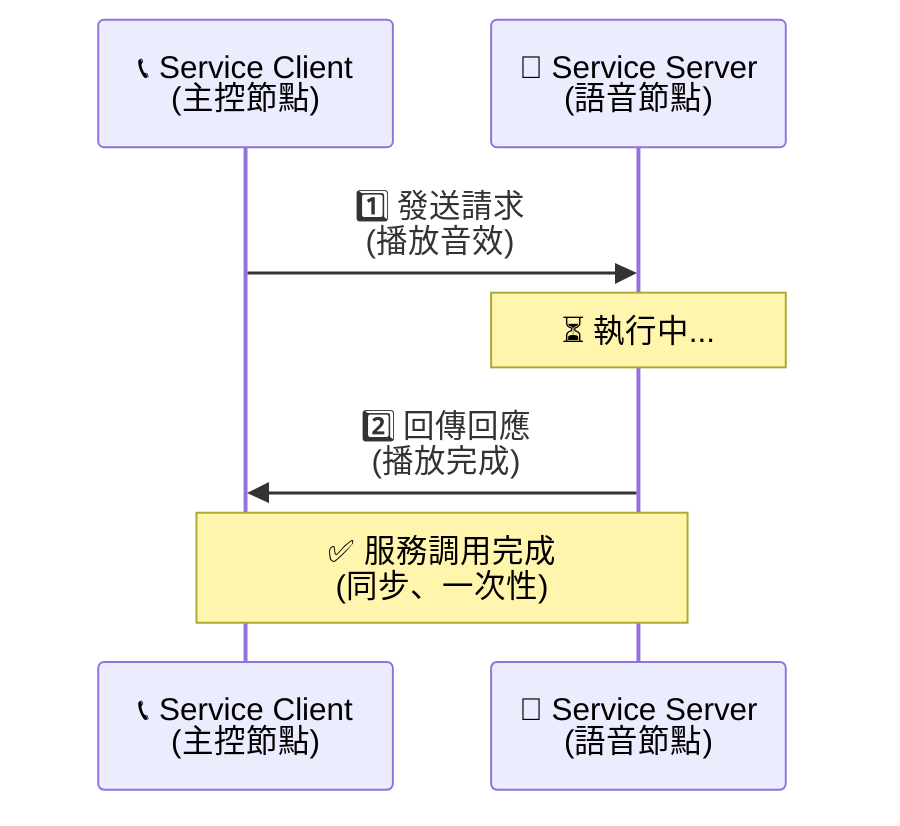
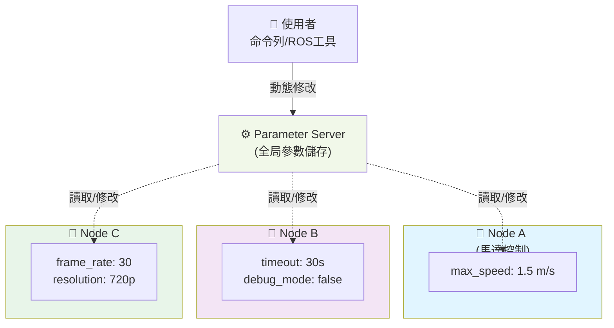
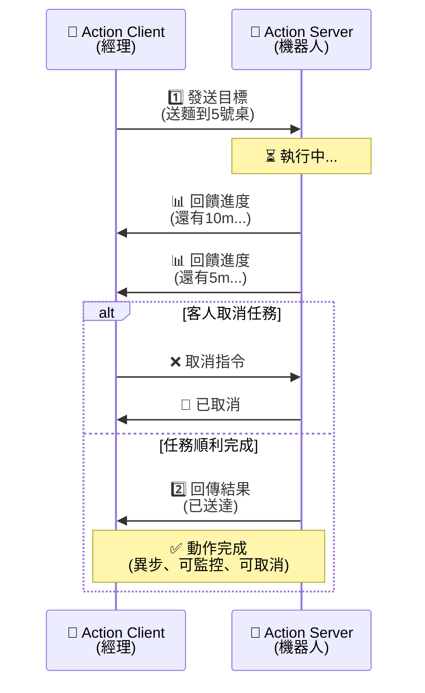

# ROS 2 Humble 基礎觀念與 CLI 工具總整理

這份文件整合了 ROS 2 Humble 官方教學的 [Beginner: CLI tools](https://docs.ros.org/en/humble/Tutorials/Beginner-CLI-Tools.html) 系列重點。內容涵蓋了 ROS 2 的核心觀念（以送餐機器人為例）、命令列工具（CLI）指令及其操作解說，幫助初學者快速掌握 ROS 2 系統的運作方式。

---

---

## 1. 環境設定 (Configuring Environment)

**觀念解說**：
ROS 2 的指令與套件依賴特定的環境變數。每次開啟新的終端機時，都必須先「載入（source）」環境設定，系統才能正確辨識 `ros2` 指令。此外，你可以透過設定 `ROS_DOMAIN_ID` 來隔離同一個區域網路下的不同 ROS 2 系統（例如多個學生在同個教室操作），避免機器人之間的訊號互相干擾。

**常用指令與操作**：
* **載入 ROS 2 底層環境**：
    ```bash
    source /opt/ros/humble/setup.bash
    ```
    *(建議將此指令加入 `~/.bashrc` 中以達成每次開機自動載入)*
* **設定 Domain ID（暫時性）**：
    ```bash
    export ROS_DOMAIN_ID=<數字>
    ```

## 2. 基礎工具：turtlesim 與 rqt

**觀念解說**：
* **turtlesim** 是一個輕量級的 2D 海龜模擬器，專為學習 ROS 2 基礎架構所設計，能直觀展示節點、主題與服務的運作。
* **rqt** 是一個強大的圖形化使用者介面（GUI）框架，包含了許多開發與除錯的實用小工具。

**常用指令與操作**：
* **啟動海龜模擬器介面**：
    ```bash
    ros2 run turtlesim turtlesim_node
    ```
* **啟動鍵盤遙控節點**（需在另一個終端機執行）：
    ```bash
    ros2 run turtlesim turtle_teleop_key
    ```
* **開啟 rqt 圖形化介面**：
    ```bash
    rqt
    ```

---

## 3. 節點 (Nodes)：系統的員工

**觀念解說**：
節點是 ROS 2 中負責執行具體任務的「最小單元」。在設計良好的機器人系統中，每個節點通常只專注做好一件特定的事情。它們就像是一間餐廳裡分工明確的員工，彼此獨立運作，再透過特定的通訊機制互相合作。
* **送餐機器人實例**：
    * **「眼睛」節點（攝影機節點）**：專門負責擷取影像畫面。
    * **「大腦」節點（導航節點）**：專門負責計算怎麼走才不會撞到牆壁。
    * **「雙腳」節點（馬達控制節點）**：專門負責送電給輪子讓機器人前進。

### 節點架構圖



**圖表解說**：
- **三個獨立的節點**（攝影機、導航、馬達控制）各自向中央匯流排註冊自己
- 每個節點都是獨立的進程，可以在不同的電腦上執行
- 所有節點向同一個 ROS 2 匯流排註冊後，才能彼此通訊
- 節點只負責完成自己的工作，不需要知道其他節點的存在

**常用指令與操作**：
* **列出目前運行中的所有節點**：
    ```bash
    ros2 node list
    ```
* **查看特定節點的詳細資訊**（包含它發布或訂閱了哪些主題、提供哪些服務等）：
    ```bash
    ros2 node info <node_name>
    ```

## 4. 主題 (Topics)：廣播電台（連續性資料）

**觀念解說**：
主題是節點之間傳遞連續資料的通道，採用 **「發布 (Publish) / 訂閱 (Subscribe)」** 的單向廣播模式。發布者（Publisher）只管一直把資料丟到特定主題上，不用管有沒有人聽；訂閱者（Subscriber）只要對該主題有興趣，就可以接收資料。一個主題可以有多個發布者和訂閱者。主題中的資料是以特定格式（Message Type）傳遞的。
* **送餐機器人實例**：
    * **攝影機節點**每秒鐘拍攝 30 張照片，它會持續「發布」到 `/camera/image` 主題。
    * **導航節點**（需要看路）和**障礙物偵測節點**（需要防撞）可以同時「訂閱」這個主題，各自拿照片去做計算。

### 主題架構圖



**圖表解說**：
- **一個發布者**不斷地把攝影機畫面丟到 `/camera/image` 主題
- **三個不同的訂閱者**各自獨立地接收這個主題的資料
- 發布者不需要知道有誰在訂閱，訂閱者也不會相互干擾
- 這就像是「一個廣播電台，多個聽眾」的模式
- 資料流是連續的、非同步的，不需要等待回應

**常用指令與操作**：
* **列出系統中所有活躍的主題**：
    ```bash
    ros2 topic list
    ```
* **列出主題並包含其訊息型態 (Message Type)**：
    ```bash
    ros2 topic list -t
    ```
* **在終端機即時印出某個主題正在傳遞的資料**：
    ```bash
    ros2 topic echo <topic_name>
    ```
* **查看主題的詳細資訊**（發布者與訂閱者數量）：
    ```bash
    ros2 topic info <topic_name>
    ```
* **測量某個主題發布訊息的頻率 (Hz)**：
    ```bash
    ros2 topic hz <topic_name>
    ```
* **透過命令列手動發布訊息到指定主題**：
    ```bash
    ros2 topic pub <topic_name> <msg_type> '<args>'
    ```
    *(例如：`ros2 topic pub --once /turtle1/cmd_vel geometry_msgs/msg/Twist "{linear: {x: 2.0, y: 0.0, z: 0.0}, angular: {x: 0.0, y: 0.0, z: 1.8}}"`)*

## 5. 服務 (Services)：打電話點餐（單次請求與回應）

**觀念解說**：
相較於主題的連續廣播，服務採用的是 **「請求 (Request) / 回應 (Response)」** 的雙向同步模式。當一個節點（Client）需要另一個節點（Server）做某件「短暫且明確」的事情時，就會發出請求。Client 必須等到 Server 做完並回傳結果後，通訊才算完成。
* **送餐機器人實例**：
    * 機器人抵達桌邊，**主控節點**（Client）向**語音節點**（Server）發出請求：「請播放『您的餐點已送達』的音效」。
    * 播放完畢後，語音節點回傳回應：「報告，音效已播放完畢」。這是一次性的動作。

### 服務架構圖



**圖表解說**：
- **Client 發送請求**並立即進入等待狀態（阻塞）
- **Server 接收請求**後開始執行任務
- **Server 完成後回傳回應**，Client 才能繼續執行後續動作
- 這個過程是**同步的**（整個過程必須完整走完）
- 適合用於「查詢資訊」、「執行計算」等短暫操作

**常用指令與操作**：
* **列出所有可用的服務**：
    ```bash
    ros2 service list
    ```
* **查看某個特定服務的資料型態**：
    ```bash
    ros2 service type <service_name>
    ```
* **透過命令列手動呼叫服務**：
    ```bash
    ros2 service call <service_name> <service_type> '<args>'
    ```
    *(例如：`ros2 service call /clear std_srvs/srv/Empty` 可以清除海龜的移動軌跡)*

## 6. 參數 (Parameters)：員工守則（配置設定）

**觀念解說**：
參數是每個節點專屬的「設定值」，類似於程式的全局變數。參數可以是整數、浮點數、布林值、字串或陣列。你可以透過設定參數，在不重新編譯程式碼的狀況下，動態改變節點的運作行為。
* **送餐機器人實例**：
    * **馬達控制節點**有一個參數 `max_speed`（最高速限）。餐廳人少時設為 `1.5 m/s`；客滿時動態下調至 `0.5 m/s` 以策安全。

### 參數架構圖



**圖表解說**：
- **Parameter Server** 是一個中央儲存庫，保存所有節點的設定值
- 每個**節點都能讀取和修改參數**，不需要重新啟動
- **使用者可透過命令列動態修改**參數，實時影響節點行為
- 適合用於調整 `max_speed`、`timeout`、`frame_rate` 等可變設定
- 參數修改後，節點會立即讀取新值（取決於節點的實作方式）

**常用指令與操作**：
* **列出各節點擁有的所有參數**：
    ```bash
    ros2 param list
    ```
* **取得某個節點內特定參數的當前數值**：
    ```bash
    ros2 param get <node_name> <parameter_name>
    ```
* **修改某個節點內特定參數的數值**：
    ```bash
    ros2 param set <node_name> <parameter_name> <value>
    ```
* **將特定節點的當前所有參數匯出（儲存）成一個 YAML 檔案**：
    ```bash
    ros2 param dump <node_name>
    ```

## 7. 動作 (Actions)：外送任務（長時間且可取消的請求）

**觀念解說**：
動作是為「需要花費較長時間執行」的任務所設計的通訊機制。它結合了主題與服務的特性，包含**目標 (Goal)、回饋 (Feedback)、結果 (Result)**。最重要的是，在執行過程中可以隨時看到進度，且**隨時可以取消**任務。
* **送餐機器人實例**：
    * **目標 (Goal)**：餐廳經理（Client）下令：「把這碗麵送到 5 號桌」。
    * **回饋 (Feedback)**：移動期間，機器人不斷回報：「距離目標還有 10 公尺... 還有 5 公尺...」。
    * **取消 (Cancel)**：若客人換位子，經理可立刻發送取消指令：「任務取消，原地待命」。
    * **結果 (Result)**：若順利抵達，最終回傳：「任務成功，已到達 5 號桌」。

### 動作架構圖



**圖表解說**：
- **Client 發送目標**後，Server 開始執行長期任務
- **Server 持續向 Client 回報進度**（Feedback），Client 可實時了解進展
- **Client 可隨時發送取消指令**，Server 立即停止任務並回應
- 若任務順利完成，Server 回傳最終結果（Result）
- 這個過程是**異步的**（Client 不需要一直等待），且支援**進度監控**與**任務取消**
- 適合用於「導航」、「抓取物體」等耗時操作

**常用指令與操作**：
* **列出系統中所有的動作**：
    ```bash
    ros2 action list
    ```
* **查看特定動作的詳細資訊**：
    ```bash
    ros2 action info <action_name>
    ```
* **手動發送動作目標**（加入 `--feedback` 可即時查看進度）：
    ```bash
    ros2 action send_goal <action_name> <action_type> '<args>' --feedback
    ```

---

## 8. 通訊機制總結比較表

| 特性 | 主題 (Topics) | 服務 (Services) | 動作 (Actions) |
| :--- | :--- | :--- | :--- |
| **通訊模式** | 單向廣播 (Pub/Sub) | 雙向一問一答 (Req/Res) | 目標、回饋、結果 |
| **執行時間** | 連續不斷 | 短暫、即時完成 | 長時間執行 |
| **可否中斷** | 無此概念 | 無法中斷（需等回應） | **可以隨時取消** |
| **適用場景** | 感測器數據（雷達、影像） | 開關燈、讀取單次狀態 | 導航、機械手臂夾取物品 |

---

## 9. 檢視日誌 (Using rqt_console)

**觀念解說**：
`rqt_console` 是一個用來檢視系統日誌（Log messages）的圖形化工具。ROS 2 的日誌訊息分為五個等級：`Fatal`（致命錯誤）、`Error`（錯誤）、`Warn`（警告）、`Info`（資訊）、`Debug`（除錯）。此工具可以幫助你過濾並找出系統出錯的原因。

**常用指令與操作**：
* **開啟日誌檢視器**：
    ```bash
    ros2 run rqt_console rqt_console
    ```

## 10. 啟動節點 (Launching Nodes)

**觀念解說**：
在複雜的機器人系統中，一次手動開啟數十個終端機並輸入 `ros2 run` 是不切實際的。**Launch 系統**允許你透過編寫 Python、XML 或 YAML 腳本（Launch files），只需一個指令就能同時啟動並設定多個節點。

**常用指令與操作**：
* **執行一個 Launch 檔案**：
    ```bash
    ros2 launch <package_name> <launch_file_name>
    ```
    *(例如：`ros2 launch turtlesim multisim.launch.py` 可以一次啟動多個海龜模擬器)*

## 11. 錄製與回放資料 (Rosbag2)

**觀念解說**：
`rosbag2` 是一個資料記錄工具，可以把系統中 Topic 傳遞的資料（例如：攝影機畫面、雷達點雲）錄製成檔案。事後你可以透過回放這些資料，來重現當時系統的狀態。這對於除錯、演算法測試以及撰寫論文數據分析非常重要。

**常用指令與操作**：
* **錄製特定主題的資料**：
    ```bash
    ros2 bag record <topic_name1> <topic_name2>
    ```
* **錄製所有主題的資料**：
    ```bash
    ros2 bag record -a
    ```
* **查看錄製檔案（bag file）的詳細資訊**（長度、包含的訊息等）：
    ```bash
    ros2 bag info <bag_file_name>
    ```
* **回放錄製的資料**：
    ```bash
    ros2 bag play <bag_file_name>
    ```

***
