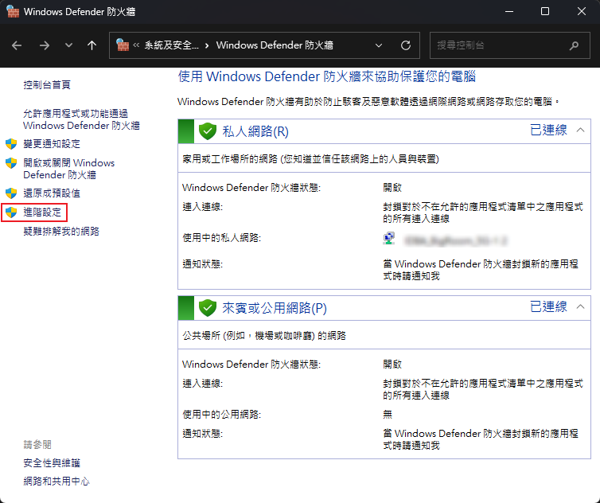
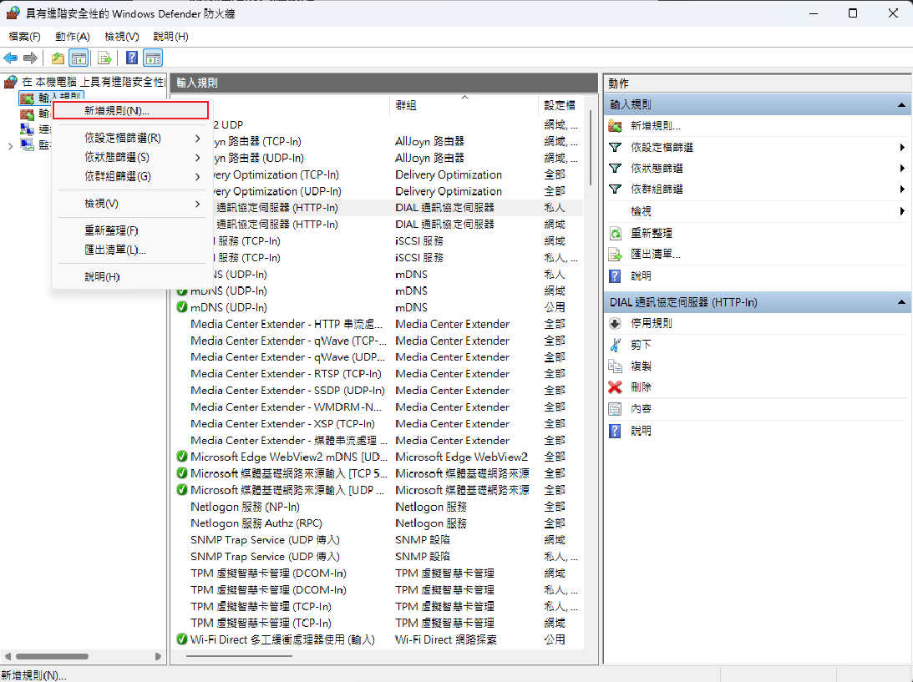

# SOP: WSL 與 TurtleBot 之間 ROS 2 訊息傳輸問題解決方案

**文件目的**：解決在 Windows Subsystem for Linux (WSL 2) 環境下，無法與 TurtleBot 正常進行 ROS 2 節點探索 (Discovery) 與訊息傳輸的通訊障礙。
**適用情境**：在 WSL 端執行 `ros2 topic list` 找不到實體機器人發布的 topic，或因處於不同網段導致無法連線的問題。

---

## 階段一：設定 WSL 鏡像網路模式 (Mirrored Networking)

將 WSL 2 的網路模式改為 `mirrored`，讓 WSL 直接共用 Windows 主機的區域網路 IP，確保 WSL 與 TurtleBot 處於相同網段。

1. **開啟使用者設定資料夾**：
   - 在 Windows 中按下 `Win + R`。
   - 輸入 `%UserProfile%` 並按下 **[確定]**。

2. **建立/編輯設定檔**：
   - 尋找該資料夾中是否有 `.wslconfig` 檔案。
   - 若無，按右鍵選擇「新增 > 文字文件」，命名為 `.wslconfig`（請注意移除 `.txt` 副檔名）。

3. **寫入配置參數**：
   - 使用「記事本」或任何文字編輯器開啟 `.wslconfig`。
   - 貼上以下內容並 **儲存檔案**：
     ```ini
     [wsl2]
     networkingMode=mirrored
     ```

4. **重新啟動 WSL**：
   - 在 Windows 搜尋列輸入 `PowerShell`，選擇 **[以系統管理員身分執行]**。
   - 輸入以下指令完全關閉 WSL：
     ```powershell
     wsl --shutdown
     ```

---

## 階段二：Windows 防火牆允許 UDP 通訊

ROS 2 底層的 DDS 通訊協定大量依賴 UDP 封包。若防火牆阻擋了 UDP，會導致節點間無法互相發現。

1. **開啟進階防火牆設定**：
   - 按下 Windows 鍵，搜尋並輸入「**防火牆**」。
   - 開啟「**Windows Defender 防火牆**」。
   - 點選左側的「**進階設定**」，開啟「具有進階安全性的 Windows Defender 防火牆」。
   

2. **新增輸入規則 (Inbound Rule)**：
   - 點選左側面板的「**輸入規則**」/「**輸出規則**」。
   - 在右側操作面板點選「**新增規則...**」。
   

3. **設定精靈步驟**：
   - **規則類型**：選擇「**連接埠**」，點選 [下一步]。
   - **通訊協定與連接埠**：選擇「**UDP**」，並選擇「**所有本機連接埠**」（或依需求選擇「特定本機連接埠」並輸入如 `53`, `5093`），點選 [下一步]。
   - **動作**：選擇「**允許連線**」，點選 [下一步]。
   - **設定檔**：勾選所有網路環境（**網域、公用、私人**），點選 [下一步]。
   - **名稱**：命名為 `ROS2 UDP Allow (WSL)`（或自訂易於辨識的名稱），點選 [完成]。

4. **(可選) 新增輸出規則 (Outbound Rule)**：
   - 為了保證雙向通訊暢通無阻，建議在左側面板選擇「**輸出規則**」，並重複執行上述 **步驟 2 與步驟 3**。

---

## 階段三：驗證與測試

完成上述設定後，請進行以下驗證以確保通訊已恢復正常。

1. **檢查 WSL IP 位址**：
   - 開啟 WSL (Ubuntu) 終端機。
   - 執行指令：
     ```bash
     hostname -I
     ```
   - **判斷標準**：輸出的 IP 應與 Windows 主機的 Wi-Fi/有線網路 IP 相同（例如同為 `192.168.x.x` 網段），而非過去預設的 `172.x.x.x` 虛擬網段。

2. **測試 ROS 2 通訊**：
   - 確保 TurtleBot 端已開啟 ROS 2 程式。
   - 在 WSL 端執行指令：
     ```bash
     ros2 topic list
     ```
     或者開啟 `rqt` 進行圖形化檢視：
     ```bash
     rqt
     ```
   - **判斷標準**：若能正常列出 TurtleBot 所發布的 topics，或是在 `rqt` 介面中能看見對應的 Node Graph 與 Topic 資訊，則代表 WSL 與 TurtleBot 的通訊問題已順利解決。
